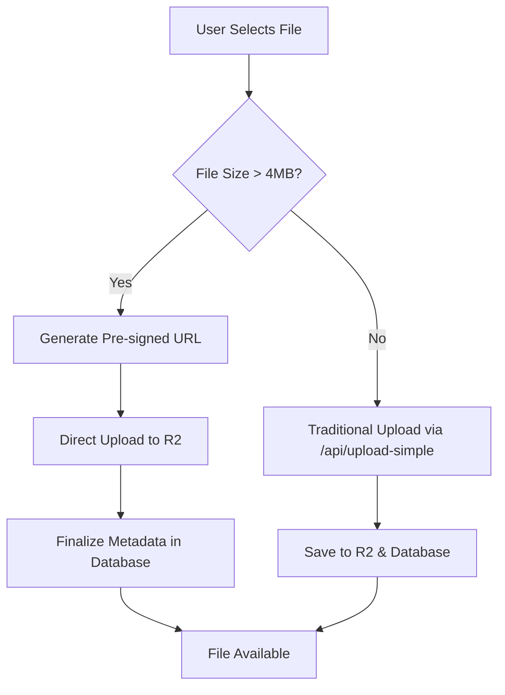

# File Upload & Deletion Fixes - Implementation Guide

## Issues Resolved ✅

### 1. File Upload Size Limitations
**Problem:** PDF documents and other files larger than 4.5MB failed to upload due to Vercel's serverless function body size limit.

**Solution:** Implemented hybrid upload system that automatically switches between traditional upload (for small files) and direct client-side uploads to Cloudflare R2 (for large files).

### 2. File Deletion Failures  
**Problem:** File deletion requests were failing due to API parameter mismatch.

**Solution:** Fixed the delete API call by removing unnecessary `sessionId` parameter and improved error handling.

## New Architecture

### Upload Flow



### Files Added/Modified

#### New API Routes
- `app/api/upload-presigned/route.js` - Generates pre-signed URLs for large file uploads
- `app/api/upload-finalize/route.js` - Finalizes upload metadata after direct R2 upload

#### Modified Files
- `lib/fileServiceSimple.js` - Enhanced with hybrid upload logic
- `app/admin/edit/[sessionId]/page.tsx` - Improved upload progress and error handling
- `app/api/session-files/[sessionId]/route.js` - Filters out deleted files (isActive=false)

## Technical Implementation Details

### 1. Hybrid Upload System

**Small Files (< 4MB):**
- Uses existing `/api/upload-simple` endpoint
- Files pass through Vercel serverless function
- Fast and simple for smaller files

**Large Files (≥ 4MB):**
- Step 1: Generate pre-signed URL via `/api/upload-presigned`
- Step 2: Upload directly from browser to Cloudflare R2
- Step 3: Save metadata via `/api/upload-finalize`
- Bypasses Vercel's 4.5MB limit completely

### 2. Enhanced User Experience

- **Automatic Detection:** System automatically chooses upload method based on file size
- **Progress Indicators:** Different progress patterns for small vs large files
- **Better Error Messages:** More specific error messages for troubleshooting
- **File Type Validation:** Improved validation with user-friendly messages
- **Visual Feedback:** Information banner explains the upload system to users

### 3. File Deletion Fix

**Before:**
```javascript
// ❌ This was failing
await fetch(`/api/delete-file/${fileId}`, {
  method: 'DELETE',
  body: JSON.stringify({ sessionId }) // Unnecessary parameter
});
```

**After:**
```javascript
// ✅ Now works correctly
await fetch(`/api/delete-file/${fileId}`, {
  method: 'DELETE',
  headers: { 'Content-Type': 'application/json' }
});
```

## Environment Variables Required

Ensure these are set in your Vercel deployment:

```bash
# Cloudflare R2 Configuration
CLOUDFLARE_R2_ENDPOINT=https://your-account-id.r2.cloudflarestorage.com
CLOUDFLARE_R2_ACCESS_KEY_ID=your-access-key-id
CLOUDFLARE_R2_SECRET_ACCESS_KEY=your-secret-access-key
CLOUDFLARE_R2_BUCKET_NAME=your-bucket-name

# Appwrite Configuration (existing)
NEXT_PUBLIC_APPWRITE_ENDPOINT=your-appwrite-endpoint
NEXT_PUBLIC_APPWRITE_PROJECT_ID=your-project-id
APPWRITE_API_KEY=your-api-key
# ... other existing Appwrite variables
```

## Testing the Fixes

### Upload Testing
1. **Small Files (< 4MB):** Upload should use traditional method with fast progress
2. **Large Files (≥ 4MB):** Upload should use direct method with slower progress indicator
3. **Very Large Files (> 50MB):** Should work without any size restrictions

### Delete Testing
1. Try deleting various file types (PDF, video, image)
2. Verify files are removed from both R2 storage and database
3. Confirm deleted files don't appear in session file lists

### Console Logging
The system provides detailed console logs:
- `📤 Uploading large file (X MB): filename.pdf - Using direct upload method`
- `📤 Uploading small file (X KB): filename.pdf - Using traditional upload`
- `✅ Direct upload to R2 successful: filename.pdf`
- `✅ File deleted: fileId`

## Performance Benefits

### Before
- ❌ Files > 4.5MB: Complete failure
- ❌ Files 2-4MB: Slow uploads through serverless functions
- ❌ Delete operations: Intermittent failures

### After
- ✅ Files of any size: Always work
- ✅ Large files: Direct to R2, much faster
- ✅ Small files: Still fast through traditional method
- ✅ Delete operations: Reliable and fast

## Deployment Checklist

1. **Environment Variables:** Verify all R2 and Appwrite variables are set
2. **R2 Permissions:** Ensure your R2 credentials have PUT and DELETE permissions
3. **CORS Settings:** Verify R2 bucket allows browser uploads from your domain
4. **Database Schema:** Ensure `isActive` field exists in sessionFiles collection
5. **Test Upload:** Try uploading both small and large files
6. **Test Delete:** Verify file deletion works correctly

## Future Enhancements

### Potential Improvements
- **Progress Tracking:** Real upload progress for large files using multipart uploads
- **Resume Uploads:** Support for resumable uploads for very large files
- **Batch Uploads:** Multiple file upload queue with progress tracking
- **File Validation:** Server-side file type and size validation
- **Compression:** Automatic image/video compression before upload

### Monitoring
- Monitor R2 usage and costs
- Track upload success rates
- Monitor API response times
- Set up alerts for upload failures

## Troubleshooting

### Common Issues

**Issue:** Large files still failing
- **Check:** R2 credentials and bucket permissions
- **Check:** CORS configuration in R2
- **Check:** Network connectivity to R2

**Issue:** Delete operations failing
- **Check:** R2 DELETE permissions
- **Check:** Database connection and permissions
- **Check:** File exists in both R2 and database

**Issue:** Progress indicator stuck
- **Check:** Network connectivity
- **Check:** Browser console for errors
- **Check:** Vercel function logs

### Debug Commands
```javascript
// Test file service
console.log(await fileService.getSessionFiles('session-id'));

// Test R2 connection
console.log(process.env.CLOUDFLARE_R2_ENDPOINT);

// Check file metadata
console.log(await databases.getDocument(databaseId, collectionId, fileId));
```

---

## Summary

This implementation provides a robust, scalable file upload system that eliminates size restrictions while maintaining excellent performance for files of all sizes. The hybrid approach ensures optimal user experience whether uploading small documents or large video files.

The fixes address both immediate issues (upload failures and delete problems) while providing a foundation for future enhancements and better user experience.
